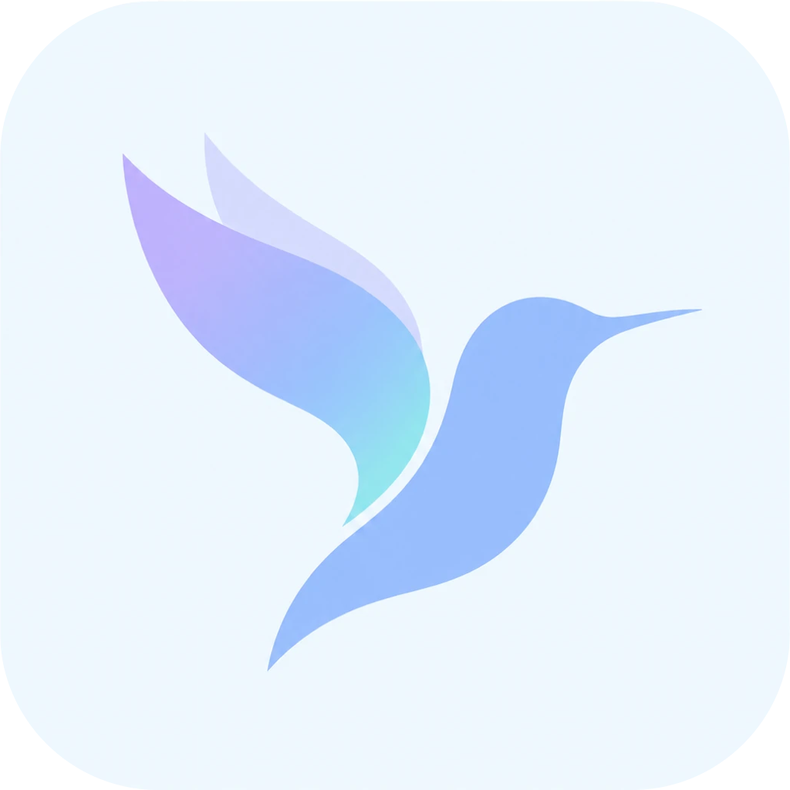

# 悬停翻译 · HoverTranslate

> 按住 ⌥,鼠标停在英文上,译文原地出现。

一个 macOS 菜单栏小工具。看海外应用和网页时,不用复制、不用切窗口、不用打开翻译软件——**看不懂就停一下,中文直接浮在那行字旁边。**

---

## 怎么取词

两条路,自动兜底:

1. **辅助功能树(Accessibility)** —— 快而且准,原生 app 上效果最好。
2. **OCR 兜底** —— Slack、Notion、GitHub Desktop 这类 **Electron 应用的辅助功能树基本是空的**,读不到文字,只能截屏识别。而平时最想翻的海外软件恰恰大量是 Electron,所以这条路不是可选项,是必需项。

取词之后还有一道**语言闸**:屏幕上本来就是中文的,不送去翻译。(早期版本会把"便宜"硬认成 `BilE` 再翻一遍,闹过笑话。)

## 现在是什么状态

**0.4.0,初版草稿,能日常用,但远没精修。**先把丑话说在前面:

- **翻译质量是目前最大的短板。**用的是 Apple 本机翻译框架,零配置、离线、免费,但质量就那样,代码修不好。换引擎是第一优先级(见下面路线图)。
- 浮层的样子还是原型,没做视觉。
- 没有图标,现在是系统默认的空白图标。
- `main.swift` 是个 800 多行的单文件,还没拆。

## 跑起来

需要 **macOS 15.2+**,以及 Xcode Command Line Tools(**不需要装完整的 Xcode**)。

```bash
git clone <仓库地址>
cd HoverTranslate
./build.sh
```

`build.sh` 会跑自测 → 构建 release → 打包安装到 `/Applications/悬停翻译.app`。

**用法**:按住 ⌥ Option,鼠标停在英文上约 0.9 秒。

不想按 ⌥ 的话,**菜单栏里可以把这个要求关掉**,关了就是纯悬停触发——省事,但鼠标扫过哪儿都会翻,自己权衡。

## 权限(这块坑多,认真看)

需要两个权限:**辅助功能** 和 **屏幕录制**。

### 这几条是 macOS 的规矩，跟本项目无关，不会变

- **辅助功能**可以直接把 app 拖进系统设置的列表里。
- **屏幕录制不能拖**,只能由 app 自己申请——先运行一次,它会弹窗,同意之后才会出现在列表里。
- **给了屏幕录制权限必须重启 app**,对已经在跑的进程永远不生效。这是系统行为,不是 bug。

### 这一条是当前构建方式的后果，以后可能消失

> **adhoc 签名 + 重新构建 = 授权会悄悄失效。**
> 系统设置里开关**还亮着**,但进程实际拿不到权限,表现就是"明明开着却不翻译"。

`build.sh` 用的是 adhoc 签名(`codesign --sign -`),每次重新构建,系统都认为这是一个不同的程序。等哪天换成正式的签名证书,这一条就不存在了。

清干净重来:

```bash
tccutil reset Accessibility local.hovertranslate
tccutil reset ScreenCapture local.hovertranslate
```

## 排障

- **诊断日志**:`~/Library/Logs/悬停翻译-诊断.log`,菜单栏里可以开关和直接打开。

  **默认是关的,这是故意的。**日志会把你悬停到的正文写进磁盘(每条最多 120 字)——排障时很有用,但你翻的可能是邮件、聊天、验证码。**只在需要排障时打开,查完记得关。**
- **离线复现整条管线**(不需要任何权限):

  ```bash
  swift run OCRProbe
  ```

  它自己造图,把 OCR → 段落拼接 → 语言闸 完整跑一遍,把中间结果打出来。排"取词不对"的问题时比看日志快得多。

- **纯逻辑自测**:`swift run HoverTranslateCoreTests`,14 项断言,不碰屏幕和权限。

## 工程结构

| 目标 | 说明 |
|---|---|
| `HoverTranslateCore` | 纯逻辑:`TextBlockAssembler`(段落拼接)、`TextNormalizer`(语言闸)。可单测 |
| `HoverTranslate` | app 本体 |
| `HoverTranslateCoreTests` | 可执行目标,不是 XCTest——XCTest 只随完整 Xcode 分发,只装了 Command Line Tools 的机器跑不了 |
| `OCRProbe` | 排障工具 |

## 路线图

1. **换翻译引擎**(最大的一块)。计划抽成协议,三档实现:Apple 本机翻译(默认、零配置)/ 本地 Ollama(免费、无 key)/ 任意 OpenAI 兼容接口(自填 base URL 和 key)。**仓库永远不存任何 key。**
2. 拆 `main.swift`
3. 做图标
4. 浮层视觉重做
5. 翻译队列改造,让 app 目标也能上 Swift 6 语言模式

## 欢迎来提意见

**以上说明由Claude完成，不保证准确性，仅供参考，直接上手操作最好。
这是初版，粗糙的地方很多，但基础使用已经足够。
最近无暇抽身，空了会精修。**

如果你用了、觉得哪里别扭、或者想要什么功能，欢迎直接告诉我——小红书 / 抖音都可以:

> **小红书** ：Quinn(小红书号 `49776595966`)
> **抖音** ：Quinn(抖音号 `84339294439`)
> **微博** ：Quinn思考切片

也欢迎直接开 Issue、提 PR,或者 fork 去改成你自己想要的样子。

## License

MIT。随便用。
